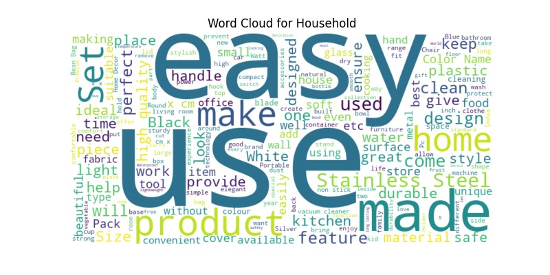
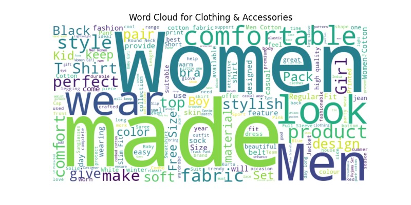
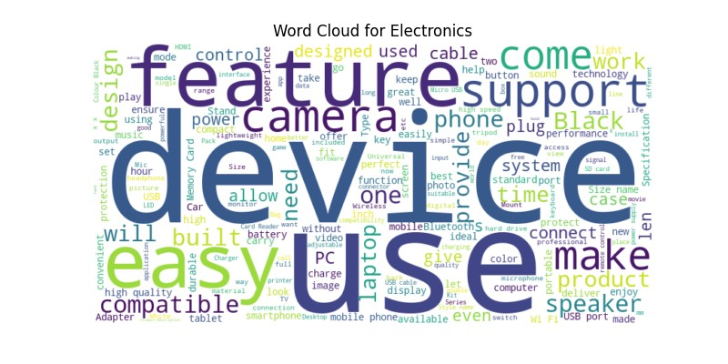
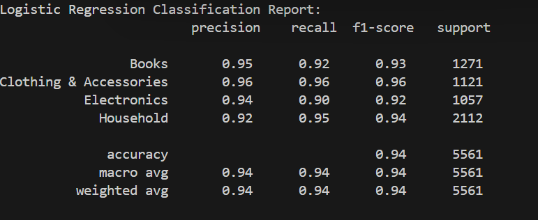
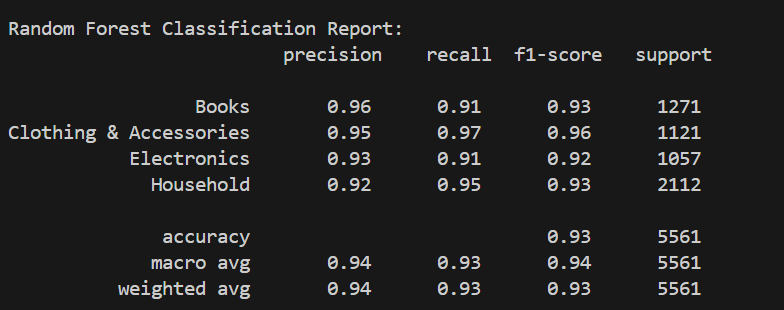
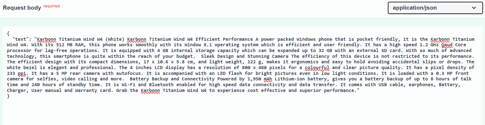
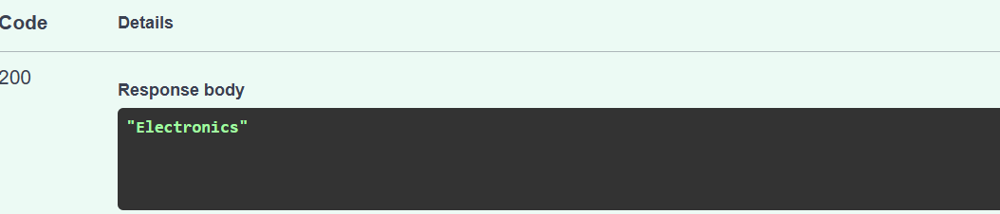

# E-commerce Text Classification Project

This repository contains a text classification model for categorizing e-commerce product descriptions into predefined categories such as Electronics, Household, Books, and Clothing & Accessories. The project involves data preprocessing, model training, and deploying the model as an API using FastAPI.

## Project Structure

The project is organized as follows:

- `preprocess.py`: Contains the code for data preprocessing including text cleaning, TF-IDF vectorization, LSA (Latent Semantic Analysis) for dimensionality reduction, and splitting the data into training and testing sets.
- `train.py`: Contains the training logic for the classification model.
- `main.py`: Combines the preprocessing and training steps, executing both in a single script.
- `app.py`: A FastAPI application to serve the trained model as a RESTful API, enabling text classification via HTTP requests.
- `Dockerfile`:Deploy the solution using docker
- `requirements.txt`: A list of required Python packages for the project.
- `src/models/`: Directory to store the trained models, vectorizers, and transformers (e.g., `model.pkl`, `vectorizer.pkl`, `lsa.pkl`).

## Setup
Step 1: Clone the Repository
Step2:Install Dependencies
- `pip install -r requirements.txt`
step3: Create a Data  Folder and store the ecommerceDataset.csv file
- `Data file`
step4:Run main.py
- `python main.py`

step5:Run the FastAPI App
 -`uvicorn app:app --reload`

 ## Word cloud for each categorey
 
 
 
 
 
 ## Classification Report of two  models Random Forest and logistic Regression on Test Data
 
 
 ## Created a FastApi endpoint to locally deploy the application and record hitting the solution endpoint via Swagger.
 - `Example  input output Via Swagger`

